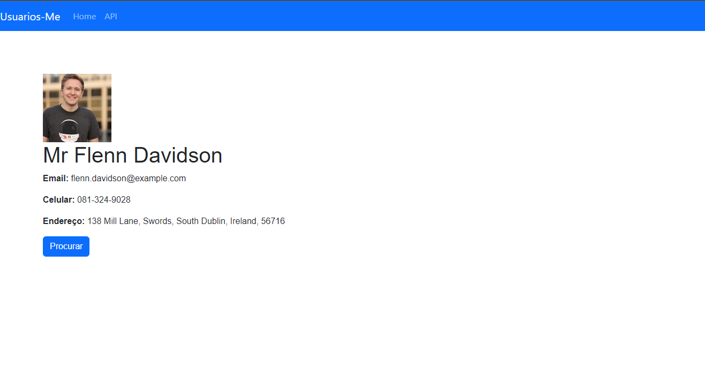

# **Exemplo React App Step-By-Step**

## **Setup**

**Requisitos:**
- Ter instalado o `npx` ou `npm` e o `nodejs`. 
- Ter instalado o Docker e Docker-compose:

**Instalando o NodeJS e NPM**: [tutorial](https://www.digitalocean.com/community/tutorials/how-to-install-node-js-on-ubuntu-20-04#option-2-installing-node-js-with-apt-using-a-nodesource-ppa)

### **Instalando o Docker e Docker-compose**
- `sudo apt-get update`
- `sudo apt-get install docker.io`
- `sudo systemctl start docker`
- `sudo systemctl status docker`
- `sudo curl -L "https://github.com/docker/compose/releases/download/1.29.2/docker-compose-$(uname -s)-$(uname -m)" -o /usr/local/bin/docker-compose`
- `sudo chmod +x /usr/local/bin/docker-compose`
- `docker-compose --version`


### **Criando um novo projeto**
Para criar um novo projeto em ReactJS, use o comando:
```bash
npx create-react-app my-app
```

### **Containerizando o projeto com Docker**
Criamos esses dois arquivos para configuração dos containers:
- [Dockerfile](Dockerfile)
- [docker-compose.yml](docker-compose.yml)

**Agora, faça o build dos containers**
Comando: `docker-compose up --build`
> *Até finalizar irá levar cerca de ~3min. Quando finalizar você verá no terminal o container rodando e uma mensagem de sucesso.*

## **Protótipo da aplicação**



## **Mão no código**

- App.js: Componente
- App.css: CSS do componente App.js
- index.js: pagina que importa e carrega o componente App.js (não mexer)

### **Componentes**
- Vamos criar a pasta `/components` dentro de `src` para guardar os nosso componentes.
- Vamos criar nosso primeiro componente:
    - Dentro do diretório `/component` vamos criar o arquivo `FirstComponent.js` Onde ficará o componente com dados do usuário como no protótipo.
    - Basta seguirmos o exemplo do que tem no `App.js`
- Todo componente é um função que retorna alguma coisa, no nosso caso será um JSX.
- Após a função é preciso exportá-la para que a gente consiga usar o componente em outras páginas.
- Todo retorno há apenas uma `Tag` Pai. Todos as demais tags devem ficar dentro da `Tag` Pai

**FirstComponent.js**
```js
function FirstComponent() {
    return (
        //Codigo JSX
        <p> Meu primeiro componente </p>
    )
}
export default FirstComponent;
```

Para conseguimos visualizar o componente que acabamos de criar, precisamos importá-lo no arquivo `App.js` e chamar ele no retorno da função.
Para chamarmos um componente, será sempre uma tag com o nome dele. A tag pode ser Self-Close `<FirstComponent />` ou você pode abrir e depois fechar `<FirstComponent></FirstComponent>`.
```JavaScript
import './App.css';
import FirstComponent from "./components/FirstComponent" //Importando o componente

function App() {
  return (
    <div className="App">
      <FirstComponent /> {/* Carrega o componente FirstComponent */}
    </div>
  );
}
export default App;
```

**PS:** No Retorno da função, que é um JSX, ao usar `{ }` o React entende que entre as chaves terá um código JavaScript para ser executado.

**OBS:** É preciso ter cuidado ao usar tags HTML no React, pois elas são nomeadas um pouco de diferente. Por exemplo o atributo `class=""` no React é `className=""`. Recomendo abrir o console do navegador, ele irá mostrar esses avisos caso use uma tag incorreta.

**Agora, rode o projeto e acesse a URL `localhost:3000` e veja se o componente foi carregado corretamente.**

---

## **Criando a Aplicação Exemplo**

### **Modificando o `FirstComponent.js`**

No início do arquivo, vamos importar o `useState`e `useEffect`
```js
import React, { useState, useEffect } from 'react';
```

Declarando o estado inicial do componente, usando o `useState`:
```js
import React, { useState, useEffect } from 'react';

function FirstComponent() {
  const [user, setUser] = useState(null);
  // user: variavel que vai receber o estado
  // setUser: funcao que vai setar o estado da variavel

  ...
```

Em seguida, vamos criar a função para lidar com a chamada do tipo GET com a API `https://randomuser.me/api/` usando o `featchAPI`. Após obter o retorno da API, vamos atualizar o estado do componente usando o função `setUser()` criado quando declaramos o estado componente.
```js
// Funcao para realizar procura de usuarios na API
  function handleSearch() {
    const apiUrl = 'https://randomuser.me/api/'

    fetch(apiUrl)
      .then(response => response.json()) // Obtem o JSON retornado pela API
      .then(data => {
        setUser(data.results[0]); // Carrega no estado com os dados do User retornado pela API.
      });
  }
```

Agora, vamos usar o `useEffect` para atualizar o estado do componente assim que o usuário entrar na página. 

Dentro da função do `userEffect` vamos chamar a função que realiza o GET para obter os usuários, para que assim que entrar na página já tenhamos um usuário carregado.

Também, vamos implementar uma verificação para exibir um loading enquanto não é carregado o usuário.
```js
// Executa quando entra na pagina
  useEffect(() => {
    handleSearch(); // Faz GET para obter usuario
  }, []);

  // Se nao tiver carregado o usuario exibe loading
  if (!user) {
    return <div>Carregando...</div>;
  }
```

Por fim, vamos retornar o JSX que será exibido para o usuário na página.

Observe que estamos carregando nos campos, os dados do `user` obtido pelo retornado da API, que foi setado nessa variável pela função `setUser()`
```js
  return (
      // Retorna JSX com preenchido com o resultado da pesquisa.

      <div className="first-component">
          
          <h1>{user.name.title} {user.name.first} {user.name.last}</h1>
          <p> <strong>Email:</strong> {user.email}</p>
          <p> <strong>Celular:</strong> {user.cell}</p>
          <p> <strong>Endereço:</strong> {user.location.street.number} {user.location.street.name}, {user.location.city}, {user.location.state}, {user.location.country}, {user.location.postcode}</p>

          <button className='btn btn-primary' onClick={handleSearch}>Procurar</button>
      </div>
    );
```

Este é o código final do `FirstComponent.js`: [FirstComponent.js](./src/components/FirstComponent.js)


### **Estizando o componente `FirstComponent`**
Para isso, no mesmo diretório do componente, vamos criar um arquivo com o mesmo nome do componente mas com a extensão `.css`. Vamos colocar o seguinte conteúdo:
```css
.first-component {
    font-family: Arial, Helvetica, sans-serif;
    text-align: left;
    padding-top: 5rem;
    padding-left: 5rem;
}

.btn {
    display: inline-block;
    font-weight: 400;
    text-align: center;
    white-space: nowrap;
    vertical-align: middle;
    user-select: none;
    border: 1px solid transparent;
    padding: 0.375rem 0.75rem;
    font-size: 1rem;
    line-height: 1.5;
    border-radius: 0.25rem;
    transition: color 0.15s ease-in-out, background-color 0.15s ease-in-out,
      border-color 0.15s ease-in-out, box-shadow 0.15s ease-in-out;
  }
  
  .btn:hover,
  .btn:focus {
    text-decoration: none;
    cursor: pointer;
  }
  
  .btn-primary {
    color: #fff;
    background-color: #007bff;
    border-color: #007bff;
  }
  
  .btn-primary:hover,
  .btn-primary:focus {
    color: #fff;
    background-color: #0069d9;
    border-color: #0062cc;
  }
```


## **Criando o componente de NavBar para o App**
### **Carregando o Boostrap**
Rodar o comando: `npm install bootstrap`

Criar arquivo: `NavBar.css` dentro da pasta `/components` com o conteúdo abaixo:
```css
@import "~bootstrap/dist/css/bootstrap.min.css";
```

Dentro da pasta `/components`, vamos criar o novo componente `NavBar.js` com o seguinte conteúdo:
```js
import './NavBar.css' //Importa CSS do componente

function Navbar() {
    return (
        <nav class="navbar navbar-expand-lg navbar-dark bg-primary">
            <a class="navbar-brand" href="/">Usuarios-Me</a>
            <button class="navbar-toggler" type="button" data-toggle="collapse" data-target="#navbarSupportedContent" aria-controls="navbarSupportedContent" aria-expanded="false" aria-label="Toggle navigation">
                <span class="navbar-toggler-icon"></span>
            </button>

            <div class="collapse navbar-collapse" id="navbarSupportedContent">
                <ul class="navbar-nav mr-auto">
                    <li class="nav-item active">
                        <a class="nav-link" href="/"> Home </a>
                    </li>
                    <li class="nav-item">
                        <a class="nav-link" href="https://randomuser.me/" target={'_blank'}  rel="noreferrer"> API </a>
                    </li>
                </ul>
            </div>
        </nav>
    );
}

export default Navbar;
```

**PS:** Essa NavBar que está sendo retornada, é a mesma ensinada na [documentação do Boostrap](https://getbootstrap.com/docs/4.0/components/navbar/)


## **Carregando a NavBar na aplicação**
Para que o componente seja carregado no App, precisamos chamá-lo no `App.js`, lembra como se faz? 
(caso não se lembre, veja como importamos o componente `FirstComponent` no arquivo `App.js` :D )


**OBS:** Nessa aplicação exemplo, colocamos todos os componentes e css deles num mesmo diretório (`/components/`), mas o ideal é que cada componente tenha sua própria pasta com um `.js` e um `.css`.
Exemplo:
```
...
src/
  components/
    FirstComponent/
      FirstComponent.js
      FirstComponent.css
    NavBar/
      NavBar.js
      NavBar.css
  ...
...
```